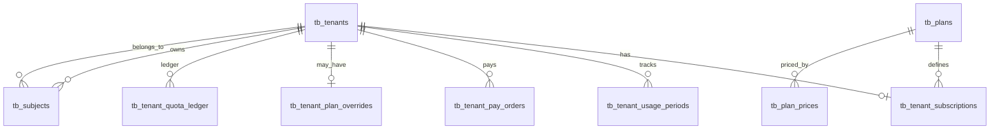

# arbin-aperix-geo — 定价方案

本文档定义 **Aperix AI** 的订阅版本、功能配额规则、计费细则与付款周期。实施订阅与配额 enforcement 时，以本文为准；与 [03-需求说明.md](./03-需求说明.md) §3.0（FR-BIL）、[04-功能清单.md](./04-功能清单.md) §1（M1/M2）对齐。

**文档索引**：[README.md](./README.md)

---

## 1. 订阅版本

产品对外提供 **四个订阅版本**（按能力递增）：

| 版本 ID | 对外名称 | 英文标识（工程） | 适用对象 |
|---------|----------|------------------|----------|
| `personal` | **个人版** | Personal | 个人或小团队，验证品牌在 AI 搜索中的可见度 |
| `premium` | **专业版** | Premium | 成长型团队，多品牌监测与更高额度 |
| `ultimate` | **旗舰版** | Ultimate | 规模化运营，多品牌、多平台与高并发监测 |
| `enterprise` | **企业版** | Enterprise | 大型组织，定制化额度、专属支持与私有化选项 |

> **租户（Tenant）** 绑定一个当前生效的订阅版本；同一租户下所有用户共享该版本的配额与用量。

---

## 2. 功能配额维度

订阅能力由 **七个可计量维度** 构成。其中 **提示词总量**、**AI 请求次数** 与 **团队席位** 为 **租户级共享**（所有 Subject / 品牌合计），其余维度为 **按品牌（Subject）** 配置与限制。

### 2.1 维度定义

| # | 维度 | 作用范围 | 说明 |
|---|------|----------|------|
| 1 | **品牌数量** | 租户 | 租户可创建的监测主体（Subject）上限 |
| 2 | **每品牌平台数** | 单品牌 | 每个品牌可勾选的 AI 采样平台数量上限 |
| 3 | **每品牌采样间隔** | 单品牌 | 自动采样间隔；默认 **每天**（`daily_1`），可选 **每3天**（`daily_3`）、**每周**（`daily_7`）；不可快于订阅计划允许的最快档位 |
| 4 | **每品牌竞争对手数** | 单品牌 | 每个品牌可配置的竞争对手（域名 + 品牌词）上限 |
| 5 | **提示词总量** | **租户共享** | 租户下所有品牌的提示词（Prompt）合计上限 |
| 6 | **AI 请求次数** | **租户共享** | 订阅 **月额度**（按月重置）+ 可选 **配额包**（加购，不重置）；见 §3.3、§3.4 |
| 7 | **团队席位** | **租户共享** | 工作区可加入的成员账号数量上限（含管理员）；邀请成员时校验 |

### 2.2 术语对照

| 产品用语 | 系统实体 | 备注 |
|----------|----------|------|
| 品牌 | `Subject` | 域名主体或品牌关键词主体 |
| 平台 | `Platform` | 如 DeepSeek、Kimi、通义等 |
| 提示词 | `Prompt` | 启用/停用均计入总量（除非产品另行规定仅计 `enabled`） |
| AI 请求 | 一次成功的 LLM API 调用 | 见 §4.6；可加购配额包（§3.4） |
| 团队席位 | `User`（租户下） | 邀请验证码加入；达上限禁止新增成员 |
| 采样间隔 | 自动调度采样 | 品牌字段 `sampling_frequency`；默认每天；品牌在「平台配置」可改间隔 |

### 2.3 各版本配额表

以下为 **V1 产品配额**（企业版为协商定制）。价格见 §3。

| 配额维度 | 个人版 | 专业版 | 旗舰版 | 企业版 |
|----------|--------|--------|--------|--------|
| 品牌数量 | 1 | 3 | 5 | 自定义 |
| 每品牌平台数 | 3 | 3 | 6 | 自定义 |
| 每品牌采样间隔（计划允许的最快档位） | 每天 | 每天 | 每天 | 自定义 |
| 每品牌竞争对手数 | 最多10个 | 最多10个 | 最多10个 | 自定义 |
| 提示词总量（租户） | 50 | 150 | 300 | 自定义 |
| AI 请求次数 / 月（租户） | 2000 | 7000 | 12000 | 自定义 |
| 团队席位（租户） | 3 | 5 | 10 | 自定义 |

**说明：**

- **采样间隔**：单品牌默认 **每天**（`daily_1`）；可在品牌 **平台配置** 改为 **每3天** 或 **每周**，保存于 `tb_subjects.sampling_frequency`。所选间隔 **不得快于** 当前订阅计划的最快档位（各档 plan 现为 `daily_1`，故三档均可选）。调度按 **北京时间日历日** 计算间隔；实际入队还需满足当日采样窗口与品牌 slot（见 §4.3）。
- **提示词**：Setup 向导生成、手动新增、批量 AI 生成均占用租户总量；跨品牌合计，**不按品牌单独封顶**。
- **AI 请求**：与提示词、平台数、采样间隔联动；可用次数 = 订阅月额度剩余 + 配额包余额（§3.4）。
- **团队席位**：管理员通过手机号验证码邀请成员；计数含当前工作区全部未删除用户。定价页 **版本卡片** 不展示此项；仅在 **完整功能对比** 表格中展示限额与说明。

---

## 3. 付款周期

订阅支持三种 **付款周期**：

| 周期 | 标识 | 说明 |
|------|------|------|
| **月度** | `monthly` | 按月订阅，每自然月续费 |
| **季度** | `quarterly` | 按季订阅，一次付清 3 个月 |
| **年度** | `yearly` | 按年订阅，一次付清 12 个月 |

### 3.1 价格（折算月均价）

以下三档价格均为 **折算后的月均价（¥/月）**；企业版为 **联系销售** 定价。人民币，含税口径由商务另行约定。

| 版本 | 月度 | 季度（-10%） | 年度（-20%） |
|------|------|-------------|-------------|
| 个人版 | ¥299 | ¥269 | ¥239 |
| 专业版 | ¥899 | ¥809 | ¥719 |
| 旗舰版 | ¥1,499 | ¥1,349 | ¥1,199 |
| 企业版 | 面议 | 面议 | 面议 |

### 3.2 周期折扣与实际扣款

| 付款周期 | 标识 | 折扣 | 说明 |
|----------|------|------|------|
| **月度** | `monthly` | 无 | 按月订阅，每月按上表「月度」列扣款 |
| **季度** | `quarterly` | **-10%** | 一次付清 3 个月，按月均价为上表「季度」列 |
| **年度** | `yearly` | **-20%** | 一次付清 12 个月，按月均价为上表「年度」列 |

**实际扣款总额**（示例）：

| 版本 | 季付总额（×3） | 年付总额（×12） |
|------|---------------|----------------|
| 个人版 | ¥807 | ¥2,868 |
| 专业版 | ¥2,427 | ¥8,628 |
| 旗舰版 | ¥4,047 | ¥14,388 |

> 展示规则：定价页展示 **折算月均价**（如上表），并辅以实际扣款说明（如「¥807/季 · 折合 ¥269/月」）。

### 3.3 账期与 AI 请求充值

| 项目 | 规则 |
|------|------|
| **订阅账期** | 与所选付款周期对齐：月付每 1 月、季付每 3 月、年付每 12 月续费一次 |
| **AI 请求充值** | **按月充值、按月重置**：每满 1 个自然月，发放 §2.3 表中对应版本的 **月额度** 并重置已用量 |
| **重置日锚点** | 与 **订阅开通日 / 续费日** 对齐（如 15 日开通，则每月 15 日重置），**不采用自然月 1 日** |
| **季付 / 年付** | 仅影响 **订阅扣款周期**；AI 请求 **不** 在账期初一次性发放多个月额度 |
| **提示词 / 品牌数等** | 在订阅有效期内持续生效，**不随 AI 请求重置而清零** |

**示例**：用户于 3 月 15 日购买「专业版 · 季付」（月额度 8,500），则 3/15、4/15、5/15 各充值 **8,500** 次并重置已用量；6/15 续费进入下一订阅账期，仍按月 8,500 充值，**不会**在 3/15 一次性发放 25,500。

### 3.4 AI 请求配额包（加购）

除订阅自带的 **月额度** 外，租户可 **单独购买** AI 请求配额包；加购次数 **租户共享**，与订阅版本无关。

#### 固定档位

| 档位 | 次数 | 价格 | 折合单价 |
|------|------|------|----------|
| 基础包 | 1,000 | ¥129 | ¥0.129/次 |
| 标准包 | 5,000 | ¥599 | ¥0.120/次 |
| 大额包 | 10,000 | ¥999 | ¥0.100/次 |

#### 自定义数量

- 不在上述三档内的数量，按 **¥0.15/次** 计价（如 2,000 次 = ¥300）。
- 可设最低起购量（如 100 次，工程可配置）。

#### 使用规则

| 项目 | 规则 |
|------|------|
| **叠加** | 配额包余额与订阅 **月额度叠加**，共同构成当前 **可用 AI 请求次数** |
| **消耗顺序** | **优先消耗订阅月额度**，月额度用尽后再消耗配额包余额 |
| **重置** | 订阅月额度按 §3.3 每月重置；**配额包余额不随月重置**，用完即止，可再次购买 |
| **购买入口** | 订阅计划页、用量不足提示、账户 / 账单页 |

> 配额包 **不替代** 订阅；仅补充 AI 请求次数，不改变品牌数、提示词等平台配额。

---

## 4. 规则细则

### 4.1 品牌数量

- 租户下 **已创建 Subject 总数** 不得超过当前版本上限。
- 创建新品牌（Setup Finalize）前校验；达上限时拒绝并引导升级。
- 降级后若已超上限：见 §5.2「降级策略」。

### 4.2 每品牌平台数

- 每个 Subject 可配置的 `Platform` 数量 ≤ 版本上限。
- 修改品牌平台配置、Setup 确认平台时均校验。
- 已选平台数超过新版本上限时，需用户手动删减后方可完成降级。

### 4.3 每品牌采样间隔

- **可选档位**（工程码 → 展示名）：
  - `daily_1` → **每天**（默认）
  - `daily_3` → **每3天**
  - `daily_7` → **每周**
- **计划约束**：`tb_plans.sampling_frequency` 表示该订阅允许的 **最快** 档位（当前各档均为 `daily_1`）。品牌所选间隔的「天数」不得 **小于** 计划档位解析出的天数（例如计划为 `daily_7` 时不可选每天）。
- **调度规则**：以 `last_sampled_at` 的 **北京时间日期** 为锚点，间隔满 `N` 个日历日后，且在当日采样窗口内、已过该品牌 slot，方可自动入队。
- **手动重采样**（用户主动触发 retry）：不计入「采样间隔」配置，但 **计入 AI 请求次数**（见 §4.6）。

### 4.4 每品牌竞争对手数

- 每个 Subject 下已配置竞品（`CompetitorDomain` + `CompetitorBrand`）总数 ≤ 版本上限。
- Setup 确认竞品、品牌设置页增删竞品时校验。

### 4.5 提示词总量（租户共享）

- 统计口径：`COUNT(prompt)` WHERE `subject.tenant_id = 当前租户`（软删不计入，若启用软删）。
- Setup 批量写入、单条新增、AI 批量生成前校验 **剩余额度**。
- **不按 Subject 单独限额**；UI 展示租户级「已用 / 总量」，切换品牌不改变总配额显示。

### 4.6 AI 请求次数（租户共享 · 按月重置）

#### 计量单位

**1 次 AI 请求 = 1 次对 LLM Provider 的成功 API 调用**（以收到有效响应为准）。

#### 计入范围

以下场景 **计入 AI 请求**；额度 **耗尽后一律禁止触发**（见「耗尽前通知 / 耗尽后拦截」）。

| 场景 | 是否计入 | 耗尽后 |
|------|:--------:|:------:|
| 自动采样（Prompt × Platform） | ✓ | 禁止 |
| 手动重采样 / retry | ✓ | 禁止 |
| Setup：画像、主题、提示词、竞品发现 | ✓ | 禁止 |
| 提示词 AI 批量生成 | ✓ | 禁止 |
| 解析链路中的独立 LLM（如 ABSA、情感） | ✓ | 禁止 |
| 纯数据库查询、Analysis 聚合 | ✗ | 不受影响 |
| 失败且未产生有效响应的调用 | ✗ | — |

> 失败调用默认不计入用量（V1 采用「成功计费」）；若额度已耗尽，仍 **不允许发起** 新的 LLM 调用。

#### 耗尽前通知

- 在 **可用 AI 请求次数**（月额度剩余 + 配额包余额）**即将耗尽** 或 **已耗尽** 时，按租户用户的 **通知设置**（账户 → 通知：站内 / 邮箱 / 微信）发送提醒。
- 仅向 **已开启对应渠道** 的用户推送；未绑定邮箱/微信时，该渠道跳过（与现有账户通知逻辑一致）。
- 建议阈值（可配置）：剩余 **20%**、**5%**、**0%**（相对 **月额度 + 当前配额包余额** 合计）；文案含已用/可用、升级或 **购买配额包** 入口。

#### 耗尽后拦截

- **可用 AI 请求次数为 0**（订阅月额度与配额包余额均已用尽）时，上表所有 **计入** 场景 **统一拦截**，不再区分自动采样 / Setup / 手动操作：
  - **自动采样**：跳过入队或标记失败；
  - **用户主动操作**（Setup、生成、retry 等）：HTTP 403，错误码 `quota_ai_requests_exceeded`；
  - **前端**：相关按钮禁用 + 引导 **升级订阅**、**购买配额包**（§3.4），或等待下次月度充值。
- **不计入** 场景（只读 Analysis、数据查询等）不受影响。

#### 充值规则

- **订阅月额度**：每月按 §3.3 规则充值并重置 `ai_requests_used`（仅计月额度部分）；月付 / 季付 / 年付均相同。
- **配额包**：支付成功后立即增加 `usage_pack_balance`；按 §3.4 消耗顺序扣减，**不随月重置**。

#### 与配置的关系（预估消耗）

单次自动采样（某品牌、某次调度）的理论消耗：

```text
AI 请求 ≈ 该品牌 enabled 提示词数 × 已选 Platform 数
```

周期内总消耗 ≈ 单次调度消耗 × 该周期内调度次数（由采样间隔决定，如每天、每3天、每周）。

租户级多品牌合计。建议在品牌配置页展示 **预估单次调度 / 周期消耗**，帮助用户理解额度消耗。

---

## 5. 订阅生命周期

### 5.1 新购与升级

| 操作 | 规则 |
|------|------|
| 新购 | 选择版本 + 付款周期 → 支付成功 → 立即生效 |
| 升级 | 立即生效；未使用部分按产品规则折算（V1 可先按「即时切换 + 新周期全价」简化） |
| 续费 | 账期结束前自动或手动续费；**续费失败立即停服**（见 §5.3） |

### 5.2 降级

| 项目 | 规则 |
|------|------|
| 生效时间 | 建议 **当前账期结束后** 生效（避免 mid-cycle 退款复杂度） |
| 数据超限 | 若降级后配额低于当前用量，进入 **只读 / 受限模式**，直至用户删减配置或升级 |
| 品牌超限 | 保留已有品牌，**禁止新建**；或要求用户指定保留 N 个活跃品牌（产品二选一，V1 推荐「禁止新建」） |
| 提示词超限 | 禁止新增提示词；已有提示词只读 |
| 平台 / 竞品超限 | 禁止保存超限配置；需删减至新版本上限 |

### 5.3 续费失败与停服

V1 **不支持试用、宽限期**。

| 场景 | 规则 |
|------|------|
| **续费失败** | `current_period_end` 到达且未成功续费 → 订阅置为 `expired`，**立即停服** |
| **停服后** | 暂停自动采样与 AI 生成；只读访问 Analysis / 已有数据（具体策略由运营约定） |
| **恢复** | 用户重新选择版本并完成支付 → 订阅恢复 `active`，按新账期开通 |

### 5.4 企业版

- 通过 **合同 + 后台 Override** 配置各维度上限，不依赖标准配额表。
- 支持私有化部署、专属支持、SLA 等商务条款（不在本文展开）。

---

## 6. 产品展示与工程映射

### 6.1 定价页展示项

每个版本卡片建议展示：

1. 版本名称与一句话描述  
2. 当前付款周期下的 **折算月均价** 与 **实际扣款额**  
3. 六维配额摘要（品牌 / 平台 / 频率 / 竞品 / 提示词 / AI 请求；**不含团队席位**）  
4. CTA：当前计划 / 选择计划 / 联系销售（企业版）

**完整功能对比** 表格另含 **团队席位** 一行（含说明 tooltip）。

另提供 **AI 请求配额包** 加购入口（§3.4），用量不足时与升级并列展示。

付款周期切换：**月度 | 季度 | 年度** 三档 Tab。

### 6.2 用量展示（账户 / 侧栏）

| 展示位 | 内容 |
|--------|------|
| 用户菜单 / 账户 | 租户级：提示词已用/总量；AI 请求已用/可用（月额度 + 配额包） |
| 账户 · 成员 | 成员已用/席位上限；达上限时禁用「邀请成员」 |
| 品牌设置 · 平台配置 | 该平台：已选平台、**采样间隔**（每天 / 每3天 / 每周）及下次预计采样提示 |
| 品牌切换器 | 品牌数已用/总量；达上限时禁用「新建品牌」 |

### 6.3 工程标识

| 对外名称 | `plan_code` |
|----------|-------------|
| 个人版 | `personal` |
| 专业版 | `premium` |
| 旗舰版 | `ultimate` |
| 企业版 | `enterprise` |

付款周期：`monthly` | `quarterly` | `yearly`。

---

## 7. 数据库表结构（待迁移）

本节描述订阅与配额 enforcement 所需的 **PostgreSQL 表结构**。Alembic migration：`034_subscription_billing`。

### 7.0 建表规范（必须）

与项目 Alembic / ORM 约定一致（见 `.cursor/rules/alembic-table-schema.mdc`）：

**标准三列（每张新建表必须包含，且 `nullable=False`）：**

| 列 | 类型 | 说明 |
|----|------|------|
| `created_at` | `timestamptz` | `server_default=now()` |
| `updated_at` | `timestamptz` | `server_default=now()`，ORM 加 `onupdate=utc_now` |
| `deleted` | `boolean` | `server_default=false`；软删标记 |

**全列 NOT NULL：** §7 所有表（含 `ALTER` 新增列）**每一列均不允许 NULL**。语义上「可选 / 未设置」用 **默认值或哨兵值** 表示，应用层按业务字段（如 `order_type`）判断字段是否有效。

| 哨兵 | 类型 | 含义 |
|------|------|------|
| `00000000-0000-0000-0000-000000000000` | `uuid` | 无关联外键（如无待生效降级、无 subject 上下文） |
| `''` | `varchar` / `text` | 无字符串值（如无支付流水号、override 继承 plan） |
| `0` | `integer` | 数值未用；**override 限额字段** `0` = 沿用 `tb_plans` |
| `1970-01-01T00:00:00+00:00` | `timestamptz` | 事件尚未发生（如未支付、未取消） |

> `ALTER` 已有表（`tb_tenants`、`tb_subjects`）仅新增列；两表已含 `created_at` / `updated_at` / `deleted`，无需重复添加。

### 7.1 与现有表的关系



**现有表变更摘要：**

| 表 | 变更 |
|----|------|
| `tb_tenants` | 新增 `usage_pack_balance`（配额包剩余次数） |
| `tb_subjects` | 新增 `sampling_frequency`（采样间隔，V1 默认 `daily_1`） |

**新增表：**

| 表 | 用途 |
|----|------|
| `tb_plans` | 订阅版本定义与七维配额上限 |
| `tb_plan_prices` | 各版本 × 付款周期价格 |
| `tb_plan_packs` | 配额包商品目录 |
| `tb_tenant_subscriptions` | 租户当前订阅与账期 |
| `tb_tenant_usage_periods` | AI 请求月额度周期与已用量 |
| `tb_tenant_plan_overrides` | 企业版等自定义配额覆盖 |
| `tb_tenant_quota_ledger` | 租户配额流水（消耗、发放、配额包购买） |
| `tb_tenant_pay_orders` | 统一支付订单（订阅 + 配额包加购） |

---

### 7.2 `tb_plans` — 订阅版本

对应 §1、`plan_code` 见 §6.3；配额默认值见 §2.3（企业版行仅作占位，实际上限走 override）。

| 列名 | 类型 | 约束 | 说明 |
|------|------|------|------|
| `id` | `uuid` | PK | |
| `code` | `varchar(32)` | UNIQUE, NOT NULL | `personal` / `premium` / `ultimate` / `enterprise` |
| `name` | `varchar(64)` | NOT NULL | 对外名称（个人版…） |
| `max_subjects` | `integer` | NOT NULL | 品牌数量上限 |
| `max_per_platforms` | `integer` | NOT NULL | 每品牌 Platform 数 |
| `max_per_competitors` | `integer` | NOT NULL | 每品牌竞争对手数 |
| `max_prompts_total` | `integer` | NOT NULL | 租户提示词总量 |
| `per_month_usages` | `integer` | NOT NULL | 租户 AI 请求月额度 |
| `max_team_members` | `integer` | NOT NULL | 租户团队席位上限 |
| `sampling_frequency` | `varchar(32)` | NOT NULL, DEFAULT `daily_1` | 计划允许的最快采样间隔档位；V1 均为 `daily_1` |
| `is_active` | `boolean` | NOT NULL, DEFAULT true | 是否对外售卖 |
| `sort_order` | `smallint` | NOT NULL, DEFAULT 0 | 定价页排序 |
| `created_at` | `timestamptz` | NOT NULL, DEFAULT `now()` | 标准列 |
| `updated_at` | `timestamptz` | NOT NULL, DEFAULT `now()` | 标准列 |
| `deleted` | `boolean` | NOT NULL, DEFAULT false | 标准列 |

**Seed 示例（配额以 §2.3 为准）：**

| `code` | `max_subjects` | `max_per_platforms` | `max_per_competitors` | `max_prompts_total` | `per_month_usages` | `max_team_members` |
|--------|----------------|----------------------------|------------------------------|---------------------|-------------------------|---------------------|
| `personal` | 1 | 3 | 10 | 50 | 2000 | 3 |
| `premium` | 3 | 3 | 10 | 150 | 7000 | 5 |
| `ultimate` | 5 | 6 | 10 | 300 | 12000 | 10 |
| `enterprise` | 999999 | 999999 | 999999 | 999999 | 999999 | 999999 |

> 企业版展示为「自定义」；真实限额写入 `tb_tenant_plan_overrides`。

---

### 7.3 `tb_plan_prices` — 版本 × 付款周期价格

对应 §3.1–§3.2。

| 列名 | 类型 | 约束 | 说明 |
|------|------|------|------|
| `id` | `uuid` | PK | |
| `plan_id` | `uuid` | FK → `tb_plans.id`, NOT NULL | |
| `billing_cycle` | `varchar(16)` | NOT NULL | `monthly` / `quarterly` / `yearly` |
| `monthly_cents` | `integer` | NOT NULL | 折算月均价（分），如 29900 |
| `period_total_cents` | `integer` | NOT NULL, DEFAULT 0 | 整期扣款（分）；`0` = 企业版面议 / 无固定标价 |
| `discount_label` | `varchar(16)` | NOT NULL, DEFAULT `''` | 展示用，如 `-10%`、`-20%`；无折扣为 `''` |
| `created_at` | `timestamptz` | NOT NULL, DEFAULT `now()` | 标准列 |
| `updated_at` | `timestamptz` | NOT NULL, DEFAULT `now()` | 标准列 |
| `deleted` | `boolean` | NOT NULL, DEFAULT false | 标准列 |

**唯一索引：** `(plan_id, billing_cycle)`

---

### 7.4 `tb_tenant_subscriptions` — 租户订阅

每个租户 **至多一条 `status = active`（或 `canceled` 账期内）** 的记录（应用层或 partial unique index 保证）。

| 列名 | 类型 | 约束 | 说明 |
|------|------|------|------|
| `id` | `uuid` | PK | |
| `tenant_id` | `uuid` | FK → `tb_tenants.id`, NOT NULL | |
| `plan_id` | `uuid` | FK → `tb_plans.id`, NOT NULL | 当前生效版本 |
| `billing_cycle` | `varchar(16)` | NOT NULL | `monthly` / `quarterly` / `yearly` |
| `status` | `varchar(32)` | NOT NULL | 见下表 |
| `current_period_start` | `timestamptz` | NOT NULL | 订阅账期开始（扣款对齐） |
| `current_period_end` | `timestamptz` | NOT NULL | 订阅账期结束 |
| `pending_plan_id` | `uuid` | FK → `tb_plans.id`, NOT NULL, DEFAULT 零 UUID | 账期末生效的降级目标；零 UUID = 无待生效变更 |
| `canceled_at` | `timestamptz` | NOT NULL, DEFAULT `1970-01-01…` | 取消时间；哨兵值 = 未取消 |
| `pay_channel` | `varchar(128)` | NOT NULL, DEFAULT `''` | 支付渠道侧订阅 ID（如 Stripe `sub_…`）；未绑定为 `''` |
| `created_at` | `timestamptz` | NOT NULL, DEFAULT `now()` | 标准列 |
| `updated_at` | `timestamptz` | NOT NULL, DEFAULT `now()` | 标准列 |
| `deleted` | `boolean` | NOT NULL, DEFAULT false | 标准列 |

**`status` 枚举建议（V1）：**

| 值 | 含义 |
|----|------|
| `active` | 正常 |
| `canceled` | 已取消（账期内仍可用至 `current_period_end`） |
| `expired` | 已停服（续费失败或账期结束未续费） |

> V1 **不含** `trialing`、`past_due`；后续若支持试用/宽限期再扩展。

**索引：** `ix_tenant_subscriptions_tenant_id`

> **不设** `ai_reset_anchor_at` / `next_ai_reset_at`：AI 月额度重置由 `tb_tenant_usage_periods` 驱动（见 §7.5）。季付/年付时订阅账期（3/12 月）与 AI 月周期（1 月）长度不同，重置时点 **不应** 冗余在 subscription 表。

---

### 7.5 `tb_tenant_usage_periods` — AI 请求月额度周期

对应 §3.3、§4.6；**每个租户每个 AI 月周期一行**。

| 列名 | 类型 | 约束 | 说明 |
|------|------|------|------|
| `id` | `uuid` | PK | |
| `tenant_id` | `uuid` | FK → `tb_tenants.id`, NOT NULL | |
| `subscription_id` | `uuid` | FK → `tb_tenant_subscriptions.id`, NOT NULL | |
| `period_start` | `timestamptz` | NOT NULL | 本 AI 月周期开始 |
| `period_end` | `timestamptz` | NOT NULL | 本 AI 月周期结束 |
| `monthly_limit` | `integer` | NOT NULL | 本周期月额度（含 override 快照） |
| `monthly_used` | `integer` | NOT NULL, DEFAULT 0 | 本周期已从 **月额度** 扣减的次数 |
| `created_at` | `timestamptz` | NOT NULL, DEFAULT `now()` | 标准列 |
| `updated_at` | `timestamptz` | NOT NULL, DEFAULT `now()` | 标准列 |
| `deleted` | `boolean` | NOT NULL, DEFAULT false | 标准列 |

**唯一索引：** `(tenant_id, period_start)`

**当前周期查询：** 取 `period_start <= now() < period_end` 的一行（或 `period_end` 最大且 `period_end > now()`）。

**开通 / 续费时：** 创建首条 usage period，`period_start` = 开通或续费日，`period_end` = `period_start + 1 个月`（同日规则，遇月末按 PostgreSQL `interval` 处理）。

**定时任务扫描索引：** `ix_tenant_usage_periods_period_end` on `(period_end)` where 未关闭周期

**可用次数计算（应用层，不存冗余列）：**

```text
available = (monthly_limit - monthly_used) + tenant.usage_pack_balance
```

消耗顺序见 §3.4：先增 `monthly_used`，月额度用尽后再减 `usage_pack_balance`。

---

### 7.6 `tb_tenants` 变更 — 配额包余额

| 列名 | 类型 | 约束 | 说明 |
|------|------|------|------|
| `usage_pack_balance` | `integer` | NOT NULL, DEFAULT 0, CHECK ≥ 0 | 配额包剩余次数；**不随月重置** |

> 若需完整审计，可另建 `tb_tenant_usage_pack_ledger`；V1 租户级余额 + `tb_tenant_pay_orders` 通常足够。

---

### 7.7 `tb_plan_packs` — 配额包商品

对应 §3.4；下单时写入 `tb_tenant_pay_orders`（`order_type = usage_pack`）。

| 列名 | 类型 | 约束 | 说明 |
|------|------|------|------|
| `id` | `uuid` | PK | |
| `code` | `varchar(32)` | UNIQUE, NOT NULL | `pack_1000` / `pack_5000` / `pack_10000` / `custom` |
| `quantity` | `integer` | NOT NULL, DEFAULT 0 | 固定档位次数；`custom` 行填 `0`（按 `unit_price_cents` × 下单量计价） |
| `price_cents` | `integer` | NOT NULL, DEFAULT 0 | 固定档位标价（分）；`custom` 行填 `0` |
| `unit_price_cents` | `integer` | NOT NULL | 单价（分）；custom = 15（¥0.15） |
| `min_quantity` | `integer` | NOT NULL, DEFAULT 100 | 自定义起购量 |
| `is_active` | `boolean` | NOT NULL, DEFAULT true | |
| `sort_order` | `smallint` | NOT NULL, DEFAULT 0 | |
| `created_at` | `timestamptz` | NOT NULL, DEFAULT `now()` | 标准列 |
| `updated_at` | `timestamptz` | NOT NULL, DEFAULT `now()` | 标准列 |
| `deleted` | `boolean` | NOT NULL, DEFAULT false | 标准列 |

**Seed：**

| `code` | `quantity` | `price_cents` | `unit_price_cents` |
|--------|------------|---------------|-------------------|
| `pack_1000` | 1000 | 12900 | 13 |
| `pack_5000` | 5000 | 59900 | 12 |
| `pack_10000` | 10000 | 99900 | 10 |
| `custom` | 0 | 0 | 15 |

---

### 7.8 `tb_tenant_pay_orders` — 统一支付订单

订阅购买/续费/升降级与 **AI 配额包加购** 共用一张订单表；账单明细 Tab 统一查询本表。

| 列名 | 类型 | 约束 | 说明 |
|------|------|------|------|
| `id` | `uuid` | PK | |
| `tenant_id` | `uuid` | FK → `tb_tenants.id`, NOT NULL | |
| `user_id` | `uuid` | FK → `tb_users.id`, NOT NULL | 下单用户（系统单可用零 UUID） |
| `order_type` | `varchar(32)` | NOT NULL | 见下表 |
| `amount_cents` | `integer` | NOT NULL | 实付总额（分） |
| `status` | `varchar(32)` | NOT NULL | `pending` / `paid` / `failed` / `refunded` |
| `paid_at` | `timestamptz` | NOT NULL, DEFAULT `1970-01-01…` | 支付完成时间；哨兵值 = 未支付 |
| `payment_id` | `varchar(128)` | NOT NULL, DEFAULT `''` | 支付渠道流水号 |
| `plan_id` | `uuid` | FK → `tb_plans.id`, NOT NULL, DEFAULT 零 UUID | 订阅类订单；配额包类填零 UUID |
| `billing_cycle` | `varchar(16)` | NOT NULL, DEFAULT `''` | 订阅类：`monthly` / `quarterly` / `yearly`；配额包类为 `''` |
| `period_start` | `timestamptz` | NOT NULL, DEFAULT `1970-01-01…` | 订阅类账期开始；配额包类用哨兵值 |
| `period_end` | `timestamptz` | NOT NULL, DEFAULT `1970-01-01…` | 订阅类账期结束；配额包类用哨兵值 |
| `product_code` | `varchar(32)` | NOT NULL, DEFAULT `''` | 配额包类：关联 `tb_plan_packs.code`；订阅类为 `''` |
| `quantity` | `integer` | NOT NULL, DEFAULT 0 | 配额包类：购买 AI 请求次数；订阅类为 `0` |
| `unit_price_cents` | `integer` | NOT NULL, DEFAULT 0 | 配额包类：成交单价快照；订阅类为 `0` |
| `created_at` | `timestamptz` | NOT NULL, DEFAULT `now()` | 标准列 |
| `updated_at` | `timestamptz` | NOT NULL, DEFAULT `now()` | 标准列 |
| `deleted` | `boolean` | NOT NULL, DEFAULT false | 标准列 |

**`order_type` 枚举：**

| 值 | 适用字段 | 支付成功履约 |
|----|----------|--------------|
| `subscription` | `plan_id`, `billing_cycle`, `period_*` | 创建/更新 `tb_tenant_subscriptions` |
| `subscription_renewal` | 同上 | 延长账期；若跨 AI 月周期则由 Beat 推进 `usage_periods` |
| `plan_change` | 同上 | 切换 `plan_id`（升级即时 / 降级账期末） |
| `usage_pack` | `product_code`, `quantity`, `unit_price_cents` | `tb_tenants.usage_pack_balance += quantity` |

**字段填法约定（均 NOT NULL，无效字段用哨兵）：**

- 订阅类：`product_code` = `''`，`quantity` / `unit_price_cents` = `0`；填写 `plan_id`、`billing_cycle`、`period_*`  
- 配额包类：`plan_id` = 零 UUID，`billing_cycle` = `''`，`period_*` = 哨兵 timestamptz；填写 `product_code`、`quantity`、`unit_price_cents`  
- `amount_cents`：订阅类 = 整期扣款；配额包类 = `quantity × unit_price_cents`（或固定档位 `price_cents`）

**索引：** `(tenant_id, created_at DESC)`、`(status)`（待支付扫描）

---

### 7.9 `tb_tenant_plan_overrides` — 企业版配额覆盖

| 列名 | 类型 | 约束 | 说明 |
|------|------|------|------|
| `id` | `uuid` | PK | |
| `tenant_id` | `uuid` | FK → `tb_tenants.id`, UNIQUE, NOT NULL | 一租户一行 |
| `max_subjects` | `integer` | NOT NULL, DEFAULT 0 | `0` = 沿用 plan |
| `max_per_platforms` | `integer` | NOT NULL, DEFAULT 0 | 同上 |
| `max_per_competitors` | `integer` | NOT NULL, DEFAULT 0 | 同上 |
| `max_prompts_total` | `integer` | NOT NULL, DEFAULT 0 | 同上 |
| `per_month_usages` | `integer` | NOT NULL, DEFAULT 0 | 同上 |
| `max_team_members` | `integer` | NOT NULL, DEFAULT 0 | 同上 |
| `sampling_frequency` | `varchar(32)` | NOT NULL, DEFAULT `''` | `''` = 沿用 plan |
| `note` | `text` | NOT NULL, DEFAULT `''` | 合同备注 |
| `created_at` | `timestamptz` | NOT NULL, DEFAULT `now()` | 标准列 |
| `updated_at` | `timestamptz` | NOT NULL, DEFAULT `now()` | 标准列 |
| `deleted` | `boolean` | NOT NULL, DEFAULT false | 标准列 |

`QuotaService` 读取限额时：整型字段 `effective = override != 0 ? override : plan`；`sampling_frequency` 非空串则用 override，否则用 plan。

---

### 7.10 `tb_subjects` 变更 — 采样间隔

| 列名 | 类型 | 约束 | 说明 |
|------|------|------|------|
| `sampling_frequency` | `varchar(32)` | NOT NULL, DEFAULT `daily_1` | 品牌自动采样间隔档位 |

**允许值：**

| 值 | 含义 |
|----|------|
| `daily_1` | 每天（默认） |
| `daily_3` | 每3天 |
| `daily_7` | 每周 |

> 历史上存在 `sampling_interval` 列（migration `014` 已删除）；调度器通过 `sampling_interval_days()` 将档位解析为整数天。品牌 PATCH 校验见 `assert_subject_sampling_frequency`。

---

### 7.11 `tb_tenant_quota_ledger` — 配额流水

由 migration `042_quota_ledger` 自 `tb_tenant_usage_events` 演进而来，统一记录 **消耗**、**订阅发放**、**配额包购买** 三类变动。

| 列名 | 类型 | 约束 | 说明 |
|------|------|------|------|
| `id` | `uuid` | PK | |
| `tenant_id` | `uuid` | FK, NOT NULL | |
| `subject_id` | `uuid` | FK, NOT NULL, DEFAULT 零 UUID | 零 UUID = 租户级、无 subject 上下文 |
| `source` | `varchar(32)` | NOT NULL | 消耗：`sampling` / `retry` / `setup` / `prompt` / `parse`；发放：`subscription` / `rollover`；购买：`usage_pack` |
| `reference_id` | `uuid` | NOT NULL, DEFAULT 零 UUID | 幂等键（如 `llm_response.id`、`usage_period.id`、`pay_order.id`） |
| `consumed_from` | `varchar(16)` | NOT NULL, DEFAULT `''` | 消耗时：`subscription` / `pack`；非消耗行留空 |
| `record_type` | `varchar(32)` | NOT NULL | `consumption` / `subscription_grant` / `usage_pack_purchase` |
| `amount_delta` | `integer` | NOT NULL | 消耗为 `-1`；发放/购买为正数 |
| `platform` | `varchar(128)` | NOT NULL, DEFAULT `''` | 采样平台（可选） |
| `input_tokens` | `integer` | NOT NULL, DEFAULT 0 | |
| `output_tokens` | `integer` | NOT NULL, DEFAULT 0 | |
| `total_tokens` | `integer` | NOT NULL, DEFAULT 0 | |
| `created_at` | `timestamptz` | NOT NULL, DEFAULT `now()` | 标准列 |
| `updated_at` | `timestamptz` | NOT NULL, DEFAULT `now()` | 标准列 |
| `deleted` | `boolean` | NOT NULL, DEFAULT false | 标准列 |

**索引：**

- `(tenant_id, created_at DESC)` — 账单页分页
- 唯一 `(tenant_id, record_type, reference_id, source)`（`reference_id` 非零 UUID 且未删除）— 幂等 dedup

**API 展示类型（`record_type` + `consumed_from` 映射）：**

| API 类型 | 含义 |
|----------|------|
| `subscription_consume` | 从订阅月额度扣减 |
| `pack_quota_consume` | 从配额包余额扣减 |
| `subscription_grant` | 周期发放 / 订阅开通 |
| `usage_pack_purchase` | 配额包购买入账 |

计数仍以 `tb_tenant_usage_periods.monthly_used` + `tb_tenants.usage_pack_balance` 为准；本表用于对账、账单明细与 disputed 排查。

---

### 7.12 迁移与初始化顺序

1. 创建 `tb_plans`、`tb_plan_prices`、`tb_plan_packs` 并 **seed**  
2. 创建 `tb_tenant_subscriptions`、`tb_tenant_usage_periods`、`tb_tenant_plan_overrides`  
3. 创建 `tb_tenant_pay_orders`、`tb_tenant_quota_ledger`（或先建 `tb_tenant_usage_events` 后由 `042` 重命名）
4. `ALTER TABLE tb_tenants ADD usage_pack_balance`  
5. `ALTER TABLE tb_subjects ADD sampling_frequency`  
6. 为现有 tenant 绑定默认 `personal` 订阅 + 首条 AI usage period（数据迁移脚本）

**定时任务（Celery Beat）：**

- 扫描 `tb_tenant_usage_periods.period_end <= now()` → 关闭旧 period、创建新 period（`monthly_used = 0`，`monthly_limit` 取当前 plan/override）  
- 扫描 `tb_tenant_subscriptions.current_period_end` → 续费成功延长账期；**失败则 `status = expired`**；账期末应用 `pending_plan_id` 降级

---

### 7.13 后端模块与 API（`/api/v1/billing`）

**服务分层（`services/billing/`）：**

| 模块 | 职责 |
|------|------|
| `constants.py` | 计费周期、订单类型、ledger record_type、分页/导出常量 |
| `limits.py` | 读取 plan + override 后的七维上限 |
| `quota.py` | 订阅校验、AI 扣费（`consume_ai_usage`）、七维 assert（含 `assert_team_member_capacity`） |
| `quota_ledger.py` | 流水 **写入**（消耗 / 发放 / 配额包购买） |
| `ledger.py` | 流水展示标签与 API 类型映射 |
| `quota_records.py` | 流水 **读取**（分页列表、CSV 导出） |
| `plan_catalog.py` / `usage_catalog.py` | 定价页目录 |
| `orders.py` / `payments.py` | 下单与支付履约 |

**主要端点：**

| 方法 | 路径 | 说明 |
|------|------|------|
| GET | `/subscription` | 当前订阅、七维限额、用量摘要 |
| GET | `/plans` | 订阅计划目录（限额 + 价格） |
| GET | `/usage-packs` | 配额包目录 |
| POST | `/orders` | 购买记录（分页） |
| POST | `/orders/subscription` | 创建订阅订单 |
| POST | `/orders/usage-pack` | 创建配额包订单 |
| POST | `/orders/{id}/cancel` | 取消待支付订单 |
| GET | `/quota-records/filters` | 配额流水筛选元数据 |
| POST | `/quota-records` | 配额流水分页列表 |
| POST | `/quota-records/export` | 导出 CSV |
| POST | `/webhook/payment` | 支付回调履约 |

> 历史路径 `/usage-events` 已移除；前端统一使用 `/quota-records`。

---

## 8. 待实现能力（开发 backlog 摘要）

订阅落地需完成：

1. **数据模型**：~~按 §7 建表与 seed~~ ✅ `034_subscription_billing` 已落地  
2. **QuotaService**：~~六维统一校验与用量查询~~ ✅ 核心已实现（`services/billing/quota.py`）；`consume_ai_usage` 经 `quota_ledger.record_consumption` 统一写入 + 幂等 dedup 已落地  
3. **API**：~~`GET /tenant/subscription`~~ ✅ `GET /api/v1/billing/subscription`；计划/配额包目录、配额流水 `POST /billing/quota-records` 已落地  
4. **Enforcement**：~~Setup finalize、Subject PATCH、Prompt CRUD~~ ✅ 七维配额已接入（品牌/平台/竞品/提示词/AI 配额/采样间隔调度/团队席位）  
5. **前端**：~~`plans.ts` 硬编码~~ ✅ 改由 `GET /billing/plans`；账单页 `/app/billing/details`（购买记录 + 配额流水）；限额 helper 见 `lib/billing/limits.ts`  
6. **支付**：~~webhook 履约~~ ✅；~~创建订单 API~~ ✅；~~前端选计划~~ ✅；**待做**：支付网关联调  
7. **Celery Beat**：~~usage period rollover / 订阅过期~~ ✅ `billing_maintenance` 每日 00:05  
8. **待做**：支付网关联调（生产环境）  
9. **站内通知**：~~P0 通知中心~~ ✅ `tb_user_notifications` + Bell；额度预警写入 inbox

---

## 9. 版本记录

| 版本 | 日期 | 说明 |
|------|------|------|
| 1.0 | 2026-06-24 | 初版：四档订阅（个人/专业/旗舰/企业）、六维配额、月/季/年付款周期与细则 |
| 1.1 | 2026-06-24 | 工程标识：`professional` → `premium`，`flagship` → `ultimate` |
| 1.2 | 2026-06-24 | §6.3 移除旧 UI 标识对照，仅保留 `plan_code` |
| 1.3 | 2026-06-24 | §3 更新三档价格：月度 ¥299/899/1499；季度 -10%；年度 -20% |
| 1.4 | 2026-06-24 | AI 请求充值/重置周期改为与付款周期对齐（§3.3、§4.6） |
| 1.5 | 2026-06-24 | 修正：AI 请求始终按月额度充值；季付/年付不一次性发放 |
| 1.6 | 2026-06-24 | 采样间隔：上限每日 1 次；后续可扩展每 3 日、每周等更低频 |
| 1.7 | 2026-06-24 | AI 请求耗尽：计入场景统一拦截；耗尽前按用户通知设置预警 |
| 1.8 | 2026-06-24 | 新增 §3.4 AI 请求配额包（129/599/999 三档 + ¥0.15/次自定义） |
| 1.9 | 2026-06-24 | 新增 §7 数据库表结构（待迁移） |
| 2.0 | 2026-06-24 | §7 表名统一：`usage_periods` / `usage_pack_*` / `usage_events` / `pay_orders` |
| 2.1 | 2026-06-24 | `tb_tenant_usage_pack_products` → `tb_plan_usage_products`（后于 2.10 重命名为 `tb_plan_packs`） |
| 2.2 | 2026-06-24 | 合并 `tb_tenant_usage_pack_orders` → `tb_tenant_pay_orders`（`order_type=usage_pack`） |
| 2.3 | 2026-06-24 | 字段重命名：`max_per_platforms`、`max_per_competitors`、`per_month_usages`、`monthly_cents` |
| 2.4 | 2026-06-24 | 移除 subscription 上 `ai_reset_*`；AI 重置改由 `tb_tenant_usage_periods` 驱动 |
| 2.5 | 2026-06-24 | `external_subscription_id` → `pay_channel` |
| 2.6 | 2026-06-24 | `ai_pack_balance` → `usage_pack_balance`（与 `usage_*` 命名统一） |
| 2.7 | 2026-06-24 | `external_payment_id` → `payment_id`（`tb_tenant_pay_orders`） |
| 2.8 | 2026-06-24 | V1 移除试用/宽限期：`trialing`/`past_due`/`trial_end_at` |
| 2.9 | 2026-06-24 | §7.0 建表规范：标准三列 + 全列 NOT NULL + 哨兵值 |
| 3.0 | 2026-06-24 | Alembic `034_subscription_billing` 落地（建表 + seed + 现有 tenant 回填 personal 订阅） |
| 3.1 | 2026-06-24 | `tb_plan_usage_products` → `tb_plan_packs`（`037_plan_packs_rename`） |
| 3.2 | 2026-06-28 | `tb_tenant_usage_events` → `tb_tenant_quota_ledger`（`042`）；API `/usage-events` → `/quota-records`；后端模块归一化（`constants` / `ledger` / `quota_records`） |
| 3.3 | 2026-06-29 | AI 月额度调整为 2000 / 7000 / 12000；新增 `max_team_members`（3 / 5 / 10，`045_plan_team_seats`）；成员邀请 enforcement |
| 3.4 | 2026-06-29 | 品牌采样间隔：`daily_1` / `daily_3` / `daily_7`；平台配置 UI + Subject PATCH；去掉 `every_3_days`、`weekly_1` 旧码 |
| 3.5 | 2026-06-29 | 产品用语统一：「监控频率」→「采样间隔」（文档、计划目录、配额错误文案） |
