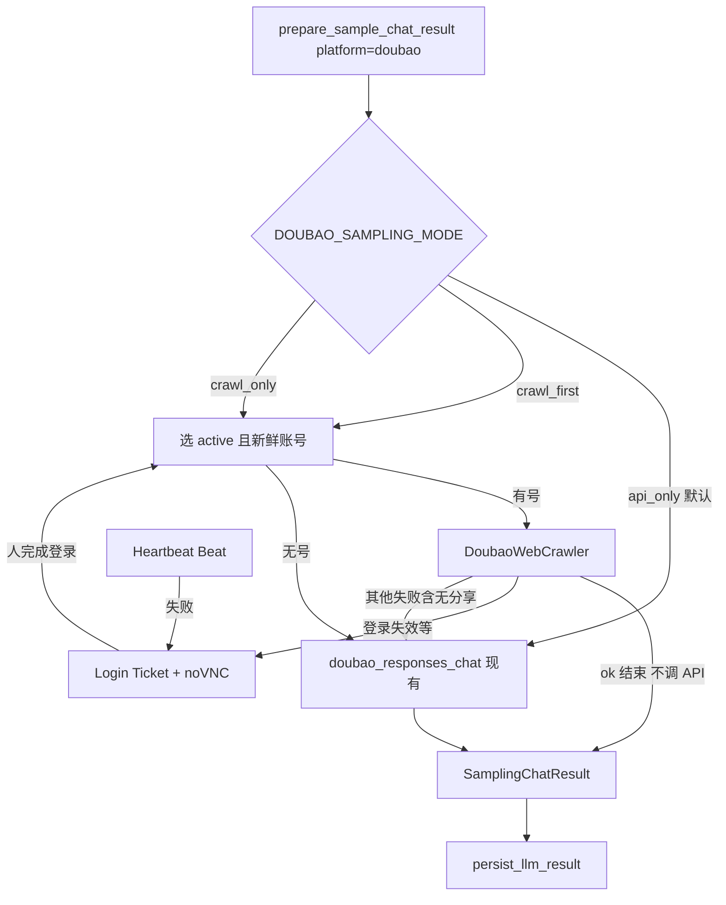
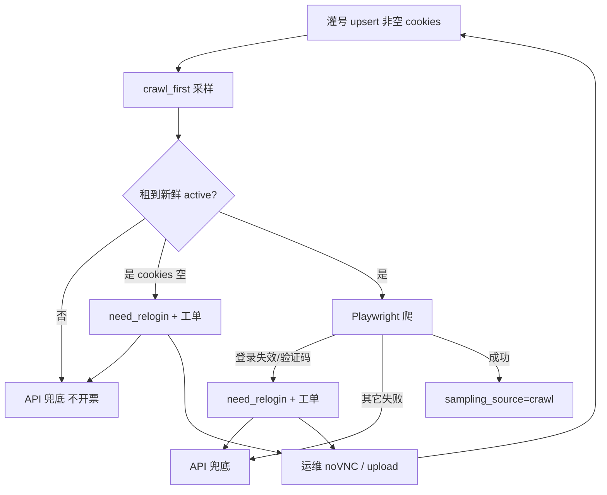

# 09 — 豆包采样改版计划（爬虫优先 · API 兜底）

> 状态：开工中（P0～P4 已落地；默认仍 `api_only`）  
> 约束：**默认不影响现网**；仅豆包渠道；开关关闭时行为与今日完全一致。  
> 依据：产品沟通（爬虫采样对齐竞品体验、账号池心跳、登录工单 / noVNC、API 兜底）。

---

## 1. 目标与非目标

### 1.1 目标

| ID | 目标 |
|----|------|
| G1 | 豆包采样支持 **Web 爬虫优先**，失败自动 **火山方舟 API 兜底** |
| G2 | **账号池** + **心跳探活**，尽量保证采样时为登录态 |
| G3 | 登录失效通过 **登录工单**（noVNC 远程桌面）半自动重登 |
| G4 | 爬虫路径以 **分享链接为证据**（对话右上角「分享」） |
| G5 | 与现有 `llm → crawl → parse`、查询扇出、Citation 流水线兼容 |
| G6 | **每次采样必须新开对话**，禁止复用历史会话线程 |

### 1.2 非目标（本计划不做）

- 不替换其他平台（Kimi / DeepSeek / 千问等）采样方式  
- 不做全自动短信验证码登录（风控 / 合规）  
- 不把纯爬虫设为全环境默认（上线默认仍 `api_only`）  
- 不在首期改造 App 真机自动化  
- 不做对话区截图 / OSS 截图归档（有分享链接即可）  

### 1.3 一句话口径

**默认仍走现有 Ark API；打开开关后，豆包才「爬虫优先 + API 兜底」；爬虫每次新对话，成功后默认落分享链接；登录靠工单人工完成验证码，采样失败不堵队列。**

### 1.4 产品硬规则（爬虫路径）

| 规则 | 说明 |
|------|------|
| **每次新对话** | 采样前必须「新建对话 / 新会话」；禁止在旧线程追加提问 |
| **默认模式** | 网页豆包默认 **快速模式**，爬虫 **不切换** 思考/深度等模式，用站内默认即可 |
| **默认证据 = 分享链接** | 点右上角「分享」→ 弹层内 **直接复制链接到剪贴板** → 写入 **`tb_llm_responses.share_url` 列**（不配置分享权限） |
| **分享失败** | 重试 1～2 次仍无链接 → `DoubaoShareError`；默认 `DOUBAO_CRAWL_REQUIRE_SHARE_URL=true` → 本条爬虫失败并 **API 兜底** |
| **成功即结束** | **爬虫成功后不再调 API**；每条 response 只有一种 `sampling_source`（`crawl` 或 `api`），**不存在同条合并扇出** |
| **占用配额** | 爬虫成功与 API 成功一样，均计入 **采样次数**（与现网 Dispatch 用量同一维度） |
| **API 兜底** | 仅爬虫失败 / 无可用账号时使用；`share_url=""`；前端分享入口走空态 |

---

## 2. 不影响现网的硬约束

| 约束 | 做法 |
|------|------|
| 默认路径不变 | `DOUBAO_SAMPLING_MODE=api_only`（默认）→ 仍调用现有 `doubao_responses_chat` |
| 代码隔离 | 新逻辑放在 `providers/doubao_web/`、`services/doubao_accounts/`，不改其他平台 `_chat` |
| 调度兼容 | 仍产出 `SamplingChatResult`，下游 phase 不强制改 |
| 无账号也能跑 | 无 `active` 账号或爬虫未部署 → 自动 API，不报整体失败 |
| 依赖可选 | Playwright / noVNC / Docker 登录镜像为可选组件；未安装时仅 API |
| 配额 / 计费 | **爬虫成功与 API 成功均占用采样次数**；爬虫路径通常无 Ark token，token 用量按实际 API 调用计（兜底时才有） |
| 灰度 | 先 staging → 单租户 / 环境变量开启 → 再扩大 |

验收：**全仓默认配置下跑现有采样单测 + 回归，与改版前行为一致。**

---

## 3. 目标架构



**路径互斥：** 同一条 `LLMResponse` 只走 crawl **或** api 一次成功落库；爬虫成功则 **跳过 API**，扇出 / 引用只来自该次结果，无需「双路径指标合并」。

### 3.1 `web_search_mode` / 来源标记

| 值 | 含义 |
|----|------|
| `doubao_native` / 现有 | API + 真实 tool 搜索（保持） |
| `doubao_web_crawl` | Web 爬虫成功 |
| `none` 等 | API 未联网或关闭搜索（保持） |

`parsed` / 表字段约定：

| 字段 | 存哪 | 说明 |
|------|------|------|
| **`share_url`** | **`tb_llm_responses.share_url` 独立列**（`Text`，NOT NULL，默认 `''`） | 主证据；**不进**可被重解析整表覆盖的 JSONB 唯一真相 |
| `sampling_source` | `parsed`（或同列旁的可选枚举列，首期 JSONB 即可） | `api` / `crawl` |
| `conversation_id` | `parsed`，哨兵 `""` | 可选，便于排查会话隔离 |

API 详情把 `share_url` 作为 **顶层字段** 返回（与 `raw_text` 同级），前端标题栏直接读该字段；旧行 / API 路径恒为 `''` → 空态。

| 路径 | `share_url` 列 |
|------|----------------|
| 爬虫成功 | 写入分享 URL（拿不到且 `REQUIRE_SHARE_URL` → 本条爬虫失败） |
| API 兜底 / 非豆包 | `''` |

#### 3.2 爬虫能采到什么（与 API 对照）

Web 回答区有可展开面板（文案形如「搜索 N 个关键词，参考 M 篇资料」）：内含 **引号包裹的搜索关键词** 与 **编号参考资料链接**（见产品截图）。爬虫应对该面板做结构化抽取。

| 数据 | 爬虫（Web） | API（兜底） | 落库 |
|------|-------------|-------------|------|
| **回复正文** | ✅ 助手气泡工具栏 **第一个按钮（复制）** → 剪贴板 Markdown → `text` / `raw_text`；失败再回退 `.md-box-root` HTML 转 MD | ✅ | 同现网；详情用现有 `ReplyMarkdownContent` 渲染 |
| **引用来源** | ✅ 面板「参考资料」`<a href>` → `source_urls`；其后仍走 `sampling_crawl` | ✅ tool/annotations | Citation |
| **查询扇出** | ✅ 面板中的关键词列表 → `search_queries_from_api` | ✅ `action.query` | 查询扩展 Tab |
| **分享链接** | ✅ 右上角 ⋯ → 分享 | ❌ | **`tb_llm_responses.share_url` 列** |

| 爬虫必采 | 说明 |
|----------|------|
| 正文 | 助手最终回复 |
| 搜索关键词 | 扇出 L1；顺序保留；去重规则同现网 `dedupe_search_queries` |
| 参考资料 URL | 与关键词同属该面板；与正文链接合并去重 |
| 分享链接 | `REQUIRE_SHARE_URL` 默认 true；写入 **独立列** `share_url` |

若面板未出现（模型未联网）：关键词与参考可为 `[]`，**合法**；与「有面板却抽失败」区分（后者应重试 / 记解析错误）。

---

## 4. 模块设计

### 4.1 采样编排（改动面最小）

文件：[`backend/src/aperix_geo/services/sampling/llm.py`](backend/src/aperix_geo/services/sampling/llm.py) 中 `_doubao_chat`

```text
api_only     → 仅现有 API（默认）
crawl_first  → 爬虫 → 失败则 API
crawl_only   → 仅爬虫（运维压测用，失败则任务失败）
```

### 4.2 Web 爬虫

目录：`backend/src/aperix_geo/services/providers/doubao_web/`

| 文件 | 职责 |
|------|------|
| `crawler.py` | **新开对话** → 发问 → 等待结束 → 抽正文 / **搜索关键词** / **参考资料** → **分享链接** |
| `selectors.py` | DOM 选择器（易碎，单独维护） |
| `accounts.py` | 取号、锁号、回写 `storage_state` |
| `errors.py` | `DoubaoCrawlError` / `DoubaoLoginExpired` / `DoubaoShareError` |

产出对齐 `SamplingChatResult`（建议增加 `share_url: str = ""`）；persist 时写入 **`LLMResponse.share_url` 列**，解析阶段 **不得清空/覆盖** 该列。

#### 4.2.1 单次采样步骤（必须）

```text
1. 使用账号 storage_state 打开豆包 Web
2. 点击「新对话」/ 打开空白会话（禁止沿用侧栏历史会话）
3. 输入本条 prompt_text，发送
4. 等待生成结束（停止按钮消失 / DOM 稳定）
5. 等待结束（必须先见停止按钮或 `[data-streaming=true]` → 再等其消失 → 再等 `.message-action-button-main`）→ 点复制读剪贴板 Markdown
6. 若存在「搜索 N 个关键词，参考 M 篇资料」面板：展开（如需要）→ 抽关键词 → search_queries；抽编号资料链接 → source_urls
7. 合并正文内其它引用 URL（去重保序）
8. 点击右上角「分享」→ 在分享弹层中触发 **复制链接**（读剪贴板或弹层内 URL 文本）→ share_url  
   （不选择/不改动分享权限；沿用豆包默认。不切换快速/思考模式。）
9. 结束；**本条不再调用 API**；下次采样再走步骤 2
```

关键词抽取约定：面板内中文引号 `“…”` / `「…」` 或英文引号包裹的片段，按出现顺序；与 API 路径一样写入 `search_queries_from_api` + `search_query_events`（platform=`doubao`）。

「新对话」校验（硬校验）：打开前记录 conversation id；`goto` 空白 `/chat/` 后若 URL **已无** conversation id则**不点**「新对话」，否则点「新对话」；发送前用 URL（不得仍停在旧 id）、无非空 `.md-box-root`、无上一轮搜索面板、消息气泡密度做判定；失败重试 1 次（重试会强制点「新对话」），仍脏则 `DoubaoCrawlError` → `crawl_first` API 兜底。

#### 4.2.2 分享链接

- 右上角「分享」→ 弹层内 **复制到剪贴板** 取得 URL（Playwright：点击复制后 `navigator.clipboard` / 读输入框值）  
- **不配置分享权限**；网页豆包默认即可  
- **不调整** 快速/深度思考等模式，使用打开对话后的默认（快速模式）  
- 写入 **`tb_llm_responses.share_url`**（独立列）；API 路径 / 其他平台恒为 `""`  
- **不要**只放在 `parsed`：重解析会重建 JSONB，证据应与 `raw_text` 一样落在表列  
- 账号池默认 **全局运维账号**（非按租户）  

### 4.2.3 前端回复详情（必做）

放在回复详情弹窗 **顶部标题栏**（平台 logo + 平台名旁，与现有「复制」正文按钮同排），增加 **「查询链接」** 入口；**不放侧栏**（侧栏仍为提及品牌 / 来源 / 查询扩展）。

| `share_url` | UI |
|-------------|-----|
| 非空（爬虫成功） | 标题栏可点外链 / 复制分享 URL（如「查询链接」按钮） |
| 空（API 兜底或旧数据） | **空态**：标题栏展示禁用或文案「暂无查询链接」，不假装有链接 |

不展示权限设置；不要求截图。

### 4.3 账号池 + 心跳

| 项 | 说明 |
|----|------|
| 存储 | **数据库表** `tb_doubao_accounts`（Alembic；标准三列 + 全列 NOT NULL；`storage_state` 加密或路径字段） |
| 状态 | `active` / `need_relogin` / `logging_in` / `blocked` |
| 心跳 | Celery Beat：`doubao_account_heartbeat`，轻量打开对话页检测登录 |
| 新鲜度 | 仅 `last_ok_at` 在阈值内（如 6h）的 `active` 可被采样选中 |
| 成功副作用 | 探活 / 采样成功后 **回写 Cookie**，尽量续期 |
| 失败 | 标 `need_relogin` + **自动开工单（若开启）** + **运维邮件（有工单才发；无冷却、失败重试）**；采样侧该条走 API |

### 4.4 登录工单（noVNC）

**noVNC**：用浏览器打开远程桌面，无需安装 VNC 客户端；运维在网页里完成豆包验证码 / 扫码。

#### 4.4.1 采样前「可用」判定（必须先满足）

采样爬虫只会租用同时满足的账号：

| 条件 | 说明 |
|------|------|
| `status = active` | 非 `need_relogin` / `logging_in` / `blocked` |
| `last_ok_at` 在新鲜窗口内 | 默认 `DOUBAO_HEARTBEAT_FRESH_S`（6h）；过期视为 stale，不租 |
| `storage_state.cookies` 非空 | **`{}` 不算有号**；租用时会标 `need_relogin` 并（若开启）自动开票 |
| 无未过期租约 | `lease_until < now` |

**灌号（采样前必做一次）：** 本机 `doubao_web_login.py` → 生产 `doubao_account_upsert.py --label … --state …`。  
仅有 `active` 行但 `storage_state={}` → 日志仍是 `no Doubao credentials` / 空 Cookie，**爬虫不可用**，走 API 兜底。

自检：

```sql
SELECT label, status, last_ok_at,
       jsonb_array_length(COALESCE(storage_state->'cookies', '[]'::jsonb)) AS cookies
FROM tb_doubao_accounts
WHERE deleted = false;
-- 采样前至少 1 行：status=active 且 cookies>0 且 last_ok_at 足够新
```

#### 4.4.2 什么时候会自动开票

前置开关：`DOUBAO_OPS_TICKET_ENABLED=true`（且建议配齐 `GEO_CRAWL_OPS_*` 以便 noVNC）。

| 时机 | 触发 | 结果 |
|------|------|------|
| **A. 爬到登录页 / Cookie 失效** | 已租到号 + `DoubaoLoginExpired` | `need_relogin` + pending 工单 + 告警；本条 API 兜底 |
| **B. 行为验证码** | 已租到号 + `DoubaoCaptchaRequired` | 同上（`reason=captcha`） |
| **C. active 但 Cookie 为空** | `acquire` 选中该行 | `need_relogin` + 工单（`login_expired` / missing cookies）；本条 API 兜底 |
| **D. 运维手动** | `doubao_ops_create.py` / Ops API | 直接 pending；可带已有 `account_id` 注入旧 Cookie |

**不会自动开票（只 API 兜底或失败）：** 池里完全没有「新鲜 active」行；超时 / 空回复 / 缺 `share_url` / DOM 错误等一般爬虫失败；仅文件冷启动且无 pool lease 时的登录失效。

#### 4.4.3 工单生命周期

| 项 | 说明 |
|----|------|
| 表 | `tb_doubao_login_tickets`：token、状态、过期、`login_url`、操作人 |
| 创建 | 系统 / 管理 API →（可选）起 Docker 登录会话（Xvfb + Chromium + noVNC） |
| 运维 | 打开 `login_url` → 完成登录 / 过验证码 |
| 回写 | 自动 `complete-by-token` 或 `doubao_ops_complete.py` upload → 写 `storage_state` → `active` → 关容器 |
| 安全 | HTTPS、token 高熵、默认约 15 分钟过期、单账号互斥 pending |
| 未部署 Docker | 工单仍可创建，靠 upload `storage_state`；**开爬虫前建议配齐** `GEO_CRAWL_OPS_*` |



#### 4.4.4 保证采样阶段可用的运维顺序

1. 配 `crawl_first` + `DOUBAO_OPS_TICKET_ENABLED` +（建议）`GEO_CRAWL_OPS_*`  
2. **先 upsert 带真实 Cookie 的账号**（上表 cookies>0）  
3. 再跑采样；Cookie 过期 / 验证码 → 自动出票 → 人修 → 账号回 `active`  
4. 空壳账号（你库里那种 `storage_state={}`）：下次 `acquire` / 心跳会开票；也可立刻  
   `doubao_ops_create.py --label … --local`，或 `doubao_heartbeat_run.py --force` 探活一轮。  

---

原简表（保留）：

| 项 | 说明 |
|----|------|
| 工单表 | `tb_doubao_login_tickets` |
| 创建 | 见 §4.4.2 |
| 运维 | 打开 `login_url` 或 upload |
| 系统 | 存 `storage_state` → `active` → 关容器 |

### 4.5 证据归档

| 优先级 | 资产 | 阶段 |
|--------|------|------|
| **爬虫必做** | `share_url` 写入 **`tb_llm_responses` 列** | 随 P2 爬虫闭环（migration 可随 P0/P2） |
| 已有 | 引用 URL → `sampling_crawl` | 不变 |

本计划 **不做截图**；证据以豆包分享链接为准。

### 4.6 部署形态（怎么定）

豆包 Playwright **不是**现有 `sampling.crawl`（那是引用页 httpx/Crawl4AI）。爬虫逻辑在 `_doubao_chat` 内，默认会落在 **`sampling.llm` worker** 上。

#### 候选

| 方案 | 做法 | 适用 |
|------|------|------|
| **A. 同进程限流（首推起步）** | `crawl_first` 仍在 `sampling_llm` 内跑 Playwright；`DOUBAO_CRAWL_CONCURRENCY` + 账号租约锁限并行；未装浏览器 → 自动 API | 本地 / staging、豆包量不大 |
| **B. 独立 worker 角色** | 新增 `CELERY_WORKER_ROLE=doubao_web`（或专用队列）；仅该机装 Chromium；`llm` 机不跑浏览器 | 现网豆包采样多、怕拖慢其他平台 API |
| **C. 远程浏览器** | Browserless 等；应用只发 CDP | 运维多镜像统一管理浏览器时再考虑 |

**不要**把豆包会话爬虫塞进现有 `sampling.crawl` 队列（职责不同、超时与并发模型不同）。

#### 决策依据（用数据拍板，不靠猜）

1. **账号数**：并行上限 ≈ `min(DOUBAO_CRAWL_CONCURRENCY, active 账号数)`，池子小则 A 足够。  
2. **豆包占比**：staging 开 `crawl_first` 后看 `sampling.llm` 队列等待与任务耗时；豆包爬虫 P95 若把其他平台 API 任务明显推迟 → 升到 **B**。  
3. **机器**：llm worker 能否装 Chromium（内存 / 无头依赖）；不能 → 必须 **B** 或暂缓 `crawl_first`。  
4. **登录工单 noVNC**：与采样 worker **分开**（按需起 Docker），不占用日常采样并发。

#### 推荐落地节奏

| 阶段 | 部署 |
|------|------|
| P1 | 开发机：本机 Playwright + 手动 cookie，不接队列 |
| P2 staging | **方案 A**：现有 llm worker 装 Chromium，并发 1～2 |
| 现网灰度前 | 用 staging 指标二选一：A 可接受则维持；否则加 **方案 B** 再开流量 |

代码侧 P0 只保证：无浏览器 / 无账号时 **降级 API**，不绑定必须先上 B。

### 4.7 爬虫耗时

| 量级（经验） | API 路径 | 爬虫路径 |
|--------------|----------|----------|
| 单条 | 常十几～几十秒（现网超时约 120s） | 常 **1～3 分钟**（等生成 + 抽面板 + 分享） |

处理原则：**限时失败可兜底，限并发不堵死队列，不指望爬虫和 API 一样快。**

| 手段 | 做法 |
|------|------|
| **硬超时** | `DOUBAO_CRAWL_TIMEOUT_S`（默认 120）；超时 / 卡住 → 爬虫失败 → `crawl_first` 下 API 兜底 |
| **限并行** | `DOUBAO_CRAWL_CONCURRENCY` + 账号租约；并行度 ≈ min(配置, 账号数) |
| **浏览器复用** | 默认 `DOUBAO_CRAWL_BROWSER_REUSE=true`：worker 进程内常驻 Chromium，每条采样新建隔离 `BrowserContext`（注入该账号 `storage_state`）；关闭复用则每次冷启。sync API 同进程串行 |
| **队列隔离** | 若拖慢其他平台 → 升 §4.6 方案 B；否则 A + 低并发即可 |
| **Claim** | 现网 `sampling_response_claim_ttl_s` 默认 2700s，覆盖单条爬虫；爬虫路径结束时照常 refresh/release |
| **Celery** | 单任务 soft/hard time_limit ≥ 爬虫超时 + API 兜底余量（例如 ≥ 120 + 120） |
| **心跳** | 探活用轻量打开页，**短超时**；与采样爬虫超时分开配置。**空 Cookie 的 active 账号每次心跳必扫**（不跟 `last_ok_at`），失败会开票（若开启 `OPS_TICKET_ENABLED`） |
| **产品预期** | 开 `crawl_first` 后豆包 job 墙钟更长属正常；夜间窗口采样可接受，白天高并发需靠账号数与 B |

验收：单条爬虫不得无限挂起；超时后本条仍能 API 完成（`crawl_first`）；其他平台 API 任务 P95 不明显恶化。

---

## 5. 配置项（全部有安全默认）

**日常只需动这些：**

```text
DOUBAO_SAMPLING_MODE=api_only    # api_only | crawl_first | crawl_only
DOUBAO_CRAWL_CONCURRENCY=1       # staging 建议先 1；默认 2
DOUBAO_CRAWL_STORAGE_STATE_PATH= # 本地冷启动；账号池就绪后可空
DOUBAO_HEARTBEAT_ENABLED=false
DOUBAO_OPS_TICKET_ENABLED=false
DOUBAO_OPS_API_TOKEN=            # 空则 ops 路由 503
# 多平台共用 noVNC（登录失效 / 行为验证码）
GEO_CRAWL_OPS_NOVNC_BASE_URL=https://novnc.example
GEO_CRAWL_OPS_DOCKER_IMAGE=aperix/geo-crawl-ops:latest
# GEO_CRAWL_OPS_CALLBACK_BASE_URL=https://app.aperix.cn
#   容器内自动 complete-by-token。生产 API 若只绑 127.0.0.1，勿用 172.17.0.1:8000（会 refused）；
#   用反代公网根地址，或让 API 听 0.0.0.0 / 同 Docker 网。
# 未配齐时仍可 upload storage_state，但运维成本更高
```

**进阶（一般不改，默认已够用）：** `DOUBAO_CRAWL_TIMEOUT_S=120`、`HEADLESS=true`、`BROWSER_REUSE=true`、`REQUIRE_SHARE_URL=true`、`CHAT_BASE_URL`、心跳 `INTERVAL_MIN` / `FRESH_S`、`ACCOUNT_LEASE_TTL_S`、`OPS_TICKET_TTL_MIN`、`GEO_CRAWL_OPS_DOCKER_NETWORK`。

**现网 `.env` 不配以上项 ⇒ 行为与今天一致（`api_only`）。**

### 5.1 Staging 开启清单（当前下一步）

生产保持 `api_only`。只在 **staging** 按序验收；noVNC 镜像未落地前，工单用 **upload `storage_state`**。

**A. 环境**

- [ ] `alembic upgrade head`（含 `share_url`、`057` 账号、`058` 工单）
- [ ] `sampling.llm` worker 已 `playwright install chromium`
- [ ] 仍保留可用 `DOUBAO_API_KEY`（兜底）
- [ ] 告警邮箱可用时开：`PROVIDER_ALERT_ENABLED=true` + `PROVIDER_ALERT_EMAIL_TO=…`

**B. 账号入库（本机有头）**

```bash
cd backend && export PYTHONPATH=src
python3 scripts/doubao_web_login.py
# 连 staging DB：
python3 scripts/doubao_account_upsert.py --label staging-1 --state data/doubao_storage_state.json
```

**C. staging 开关**

```text
DOUBAO_SAMPLING_MODE=crawl_first
DOUBAO_CRAWL_CONCURRENCY=1
DOUBAO_HEARTBEAT_ENABLED=true
DOUBAO_OPS_TICKET_ENABLED=true
DOUBAO_OPS_API_TOKEN=<随机高熵>
```

**D. 验收**

- [ ] 触发一条豆包采样：`sampling_source=crawl`，有 `share_url`，日志无二次 Ark 调用
- [ ] 人为弄失效 / 等验证码：账号 `need_relogin`，有告警；本条仍 API 完成
- [ ] 工单闭环：`doubao_ops_create.py` → 本机重登导出 → `doubao_ops_complete.py` → 账号回 `active`
- [ ] 详情标题栏「查询链接」可跳转；API 路径空态正常

**E. 通过后再做**

1. 落地 noVNC（镜像 + 起容器，去掉 upload 主路径）  
2. 看 `sampling.llm` 是否拖慢其他平台 → 再定是否队列隔离  
3. 生产灰度（仍先小流量 / 可回滚 `api_only`）

---

## 6. 分期交付与验收

| 阶段 | 内容 | 默认开关 | 验收 | 现网影响 |
|------|------|----------|------|----------|
| **P0** | ✅ 配置项 + `_doubao_chat` 分支骨架；**`share_url` 列 migration**；`api_only` 单测 | `api_only` | 现有测试全绿；列默认 `''` | 无 |
| **P1** | ✅ 本地爬虫：新对话 + 正文 + 关键词 + 参考资料 + 分享（复制剪贴板） | 不接流量 | 默认快速模式不改；有分享链接 | 无 |
| **P2** | ✅ `crawl_first`（成功不调 API）+ 兜底计采样次数 + 详情标题栏「查询链接」 | staging | 爬虫成功无二次 API；API 路径分享空态 | 仅显式开 |
| **P3** | ✅ **`tb_doubao_accounts` 表** + 取号租约 + 心跳 | `HEARTBEAT=false` | 账号落库；失效标 need_relogin | 仅显式开 |
| **P4** | ✅ 登录工单 + ops API（上传兜底；noVNC 占位） | `TICKET=false` | 人工完成一单重登（CLI） | 仅显式开 |
| **P5** | 管理后台账号列表 / 一键开工单（可选） | 同上 | 运维可自助 | 仅运维 |

每阶段合并主线前：**默认配置回归 = 改版前。**

---

## 7. 风险与对策

| 风险 | 对策 |
|------|------|
| 豆包 DOM 改版 | `selectors.py` 隔离；冒烟用例；失败即 API |
| 登录态周～月级失效 | 心跳 + 工单；永不假设永久登录 |
| 机房 IP 风控 | 控制并发；账号轮换；必要时固定出口 |
| **行为验证码** | **与登录失效同一人工路径**（`DoubaoNeedsHumanOps`）：检出即出池 → `need_relogin` → **登录工单**（`GEO_CRAWL_OPS_REASON=captcha`，注入旧 Cookie，过人机后验证码消失即自动 `complete-by-token`）+ **运维告警**。**禁止自动打码**；采样浏览器内不等待过人机。`crawl_first` 下本条可 API 兜底，账号须工单完成后才回池 |
| noVNC 暴露面 | 内网 / VPN、短时 token、过期杀容器 |
| 爬虫变慢拖垮队列 | 独立 worker / 低并发；与 `sampling.llm` API 任务隔离 |
| 扇出 / 参考面板 DOM 变更 | 按「搜索 N 个关键词，参考 M 篇资料」文案定位；冒烟用例固定夹具 HTML |
| 模型未联网 | 无该面板 → 关键词/参考为空，合法 |
| 误用旧会话 | 强制点「新对话」+ DOM 校验；失败重试或 API |
| 分享按钮/链接 DOM 变更 | 单独封装分享步骤；重试后仍失败则爬虫失败 → API 兜底 |
| 分享链接日后失效 | 同时持久化 `raw_text`；UI 标明采集时刻 |

---

## 8. 测试计划

| 类型 | 内容 |
|------|------|
| 单元 | `api_only` 仍调 API；`crawl_first` mock 爬虫失败 → API |
| 集成 | staging：爬虫成功有 share_url 且 **未再调 API**；扇出来自该条 parsed |
| 回归 | `tests/test_web_search_providers.py` 豆包解析用例不变 |
| 前端 | 标题栏：API / 空 share_url → 空态；有链接可跳转 / 复制 |
| 配额 | 爬虫成功记 1 次采样用量 |
| 工单 | 过期回收、取消工单、检测登录成功/失败 |
| 会话隔离 | 连续 2 次采样的 `conversation_id` / 会话 URL 不得相同 |
| 混沌 | 无账号、心跳全挂 → 采样全部 API 且 job 可完成 |

---

## 9. 文档与功能清单（落地后勾选）

- 本文件：改版主计划  
- [`04-功能清单.md`](./04-功能清单.md)：Dispatch 增补「豆包 Web 采样 / 账号池 / 登录工单」（V1/V2，默认关闭）  
- [`06-分析指标.md`](./06-分析指标.md)：`sampling_source` / `doubao_web_crawl` 字段说明  
- 运维 runbook（可后补）：如何开心跳、如何开登录工单、如何轮换账号  

---

## 10. 建议开工顺序（执行清单）

1. **P0～P4 代码**：✅ 已落地（默认仍 `api_only`）。  
2. **本机冒烟**：✅ `doubao_web_login` / `doubao_web_smoke`。  
3. **当前 → Staging 开 `crawl_first`**：按 §5.1 清单验收（工单暂 upload）。  
4. **下一步工程**：noVNC **按端口反代**（见 `docker/geo-crawl-ops/proxy.nginx.example`）；staging 开 `crawl_first` 验收。镜像：注入 Cookie；`login_expired` 靠 Cookie 变化关单，`captcha` 靠验证码消失关单（需 `GEO_CRAWL_OPS_CALLBACK_BASE_URL`）。  
5. **可选**：P5 管理后台；队列隔离（方案 B）；DeepSeek/千问复用同一 `GEO_CRAWL_OPS_*`。  

未经环境变量显式开启前，**禁止**将默认改为 `crawl_first`。

---

## 11. 决策摘要（已对齐沟通）

| 议题 | 结论 |
|------|------|
| 采样主路径 | 爬虫优先；**成功则不再调 API**；失败才 API 兜底 |
| 默认现网 | `api_only`，零行为变化 |
| **会话** | 每次新对话；**不改快速模式**（用网页默认） |
| **证据** | 分享 → 剪贴板 → **`tb_llm_responses.share_url` 列**；无权限配置；不做截图 |
| **正文 / 引用 / 扇出** | Web 面板采集；单条仅一种来源，**无扇出双路径合并** |
| **配额** | **爬虫与 API 均占用采样次数** |
| **账号** | **全局** `tb_doubao_accounts` + 取号租约锁 + 心跳 + 登录工单 |
| **前端** | 标题栏「查询链接」读顶层 `share_url`；空则空态 |
| 全自动短信登录 | 不做 |
| 其他平台 | 本计划不动 |
